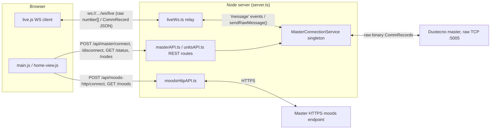

# Codebase Guide

How to read and navigate the Duotecno Configuration Software frontend.

---

## Entry points

| Layer | File | Role |
|-------|------|------|
| **HTTP server** | `src/server.ts` | Express server, port 3000. Mounts static files from `public/` and all API routes. Start here to understand what the server does. |
| **API routes** | `src/api/*.ts` | One file per domain: `masterAPI.ts` (TCP connect), `projectAPI.ts` (save/load), `moduleAPI.ts` (module DB). Each registers routes on an Express Router. |
| **Browser entry** | `public/index.html` | Loads `app/main.js` as an ES module. That is the browser entry point. |
| **App bootstrap** | `public/app/main.js` | Imports state + components, wires up header buttons (save, load, upload, connect), calls `renderRailView()` on state changes. |

---

## State management

All UI state lives in **`public/app/state.js`** — a single reactive store.

```
state.get()          → returns current state snapshot
state.subscribe(fn)  → fn called on every state change
dispatch({ type, ...payload })  → sends an action to the reducer
makeId()             → generates a short random ID
```

The reducer at the bottom of `state.js` handles every `type`. There are no side-effects in the reducer — it only transforms state. API calls happen in `main.js` or component handlers, and their results are fed back via `dispatch`.

**State shape** (simplified):

```js
{
  meta: { name, created, modified, version },
  project: {
    railView: {
      cabinets: [{ id, name, widthUnits, modules: [ModuleInstance] }],
      woningDevices: [WoningDevice],
    }
  },
  modules: [...],          // module DB loaded from /api/modules
  discoveredNodes: [...],  // result of last TCP scan
  connection: { ip, password, connected }
}
```

**Action types** (all in `state.js`):

| Action | What it does |
|--------|-------------|
| `SET_MASTER_CONFIG` | Store connection info |
| `SET_CONNECTION` | Mark connected + store discovered nodes |
| `ADD_DISCOVERED_NODES` | Classify unmatched nodes → cabinet / woning |
| `ADD_CABINET` | Add a cabinet |
| `UPDATE_CABINET` | Rename / resize cabinet |
| `REMOVE_CABINET` | Delete cabinet |
| `ADD_MODULE` | Add module to cabinet |
| `UPDATE_MODULE` | Change model, nodeAddress, etc. |
| `REMOVE_MODULE` | Delete module from cabinet |
| `MOVE_MODULE` | Reorder module within cabinet |
| `ADD_WONING_DEVICE` | Add device to woning panel |
| `UPDATE_WONING_DEVICE` | Change model / name / address |
| `REMOVE_WONING_DEVICE` | Delete woning device |
| `MOVE_WONING_DEVICE` | Reorder woning device |
| `LOAD_PROJECT` | Replace entire project (load from .duo file) |

---

## Components

All in `public/components/`. Each is a plain ES module with no framework.

| File | What it renders |
|------|----------------|
| `rail-view.js` | The main canvas: cabinets, rails, module cards, woning panel, CAN SVG snake. Entry: `renderRailView(container)`. |
| `module-picker.js` | Modal for picking a module model. Entry: `openModulePicker(context)`. The `context` object controls whether it's adding to a cabinet or woning, and whether it replaces an existing module. |

### `rail-view.js` internals

```
renderRailView(canvas)          ← called by main.js on every state change
  buildCabinetCard(cabinet)     ← one card per cabinet
    reflowToRails(cabinet)      ← distributes flat modules[] into rails by DIN width
    buildRail(rail, cabinetId)  ← renders one DIN rail with modules
      buildModuleSlot(...)      ← one module card with CAN dots
  buildWoningPanel(devices)     ← the woning panel below
    buildFieldDevice(wd)        ← one switch/LCD card
  drawCanSnake(canvas)          ← SVG lines connecting all rails + woning rows
```

Modals open imperatively (they don't re-render from state):
- `openModuleDetail(moduleInstance, cabinetId)` — click on a cabinet module
- `openWoningDeviceDetail(wd)` — click on a woning device

---

## Data models

Defined in `src/models/project.ts` (TypeScript, used server-side for save/load validation):

```ts
ModuleInstance   { id, model, nodeAddress?, physicalAddress?, name?, position, slots? }
Cabinet          { id, name, widthUnits, modules: ModuleInstance[] }
WoningDevice     { id, model, nodeAddress?, name?, position }
ProjectMeta      { name, created, modified, version, masterIp?, masterPassword? }
```

The **module DB** is `modules/_index.json` (115 entries). Each entry has:
```json
{ "model": "DT05-06TE", "name": "...", "category": "dimmer|relay|input|motor|audio|switch|lcd",
  "dinUnits": 6, "powerW": 18, "imageFile": "..." }
```

`category` drives:
- Which picker tab shows the module
- Whether it belongs in the cabinet or woning panel
- The `isWoningModel` check in `module-picker.js` → auto-move on assign

---

## TCP communication & live connection architecture

```
src/services/MasterConnectionService.ts   ← singleton, holds the open TCP socket to the Duotecno master
src/communication/DuotecnoProtocol.ts     ← encode/decode binary Duotecno messages (CommRecord)
src/api/masterAPI.ts                      ← REST → MasterConnectionService bridge (connect/disconnect/status/nodes)
src/api/liveWs.ts                         ← WebSocket bridge, pure bidirectional relay
src/api/unitsAPI.ts                       ← pure-data REST endpoints (unit/node lookups)
src/api/moodsHttpAPI.ts                   ← separate HTTPS API used only for mood/scene listing
```

There are **three independent connections** in play, each with a different transport and a different lifecycle:



**1. Master TCP connection** (`MasterConnectionService`, server-side singleton)
- Opened/closed exclusively via REST: `POST /api/master/connect { host, port, password }` and `POST /api/master/disconnect`. Internally reconnects if host/port changed.
- `GET /api/master/status` polls `ConnectionStatus` (`Disconnected → Connecting → LoggedIn → Discovering → Ready`/`Error`).
- `GET /api/master/nodes` runs the discovery poll loop and returns `DiscoveredNode[]`. The browser calls this from `main.js → doConnect()`.
- Emits a `'message'` event for every `CommRecord` (parsed binary frame) it receives from the master, plus narrower events (`disconnected`, `discovery-complete`, etc.) used internally by the discovery flow.

**2. Browser ↔ server WebSocket** (`liveWs.ts` + `public/app/live.js`) — **pure relay, no protocol translation**
- `liveWs.ts` forwards every `MasterConnectionService` `'message'` event verbatim to all connected WS clients, and forwards any raw `number[]` sent by a client straight into `masterService.sendRawMessage()`. It does not interpret, filter, or extend the wire protocol in any way.
- The browser's WS lifecycle is tied to the "Verbinden met master" modal: `connectLive()` opens the socket after a successful `/api/master/connect`, `disconnectLive()` closes it on disconnect. It is **not** a separate control channel — it only mirrors the already-open master TCP session.
- `public/app/protocol.js` is the client-side mirror of the binary command/status format (builders like `buildSetSwitch`/`buildSetDimmer`/`buildSetMotor`/`buildMoodTrigger`/`buildSensorIncDec`, and `decodeStatus()` for incoming status records) — it must be kept in sync with `DuotecnoProtocol.ts` server-side by hand.
- `public/app/live.js` keeps a small live-status cache (`getLiveUnit`) and a pub/sub emitter (`onLiveUpdate`) so components like `home-view.js` can render live status and send raw control messages (`sendRaw`).

**3. Moods HTTPS API** (`moodsHttpAPI.ts`) — separate connection
- The master also exposes an HTTPS endpoint (independent of the TCP protocol) purely for listing configured moods/scenes. `POST /api/moods-http/connect` opens it, `GET /api/moods-http/moods` reads the list. Unrelated to the TCP/WS live-control path above.

**4. Pure-data REST endpoints** — no master connection involved
- `projectAPI.ts` (save/load `.duo` project files), `moduleAPI.ts` (module DB), `unitsAPI.ts` (static unit/node metadata lookups from the discovered project) — these just read/write local files or in-memory project state.

---

## Key conventions

- **No framework** — vanilla ES modules in the browser, no build step for the frontend.
- **Dispatch is synchronous** — `dispatch()` runs the reducer immediately; `state.subscribe` fires synchronously after.
- **Re-render on every dispatch** — `main.js` subscribes once and calls `renderRailView()` on every state change. Components are stateless and idempotent.
- **Absolute positions for labels** — `fd-label` and `fd-addr` in the woning panel use `position:absolute` so they don't affect flex row height calculations.
- **CSS lives next to JS** — `components/rail-view.css` is imported via `<link>` in `index.html`, not injected by JS.
